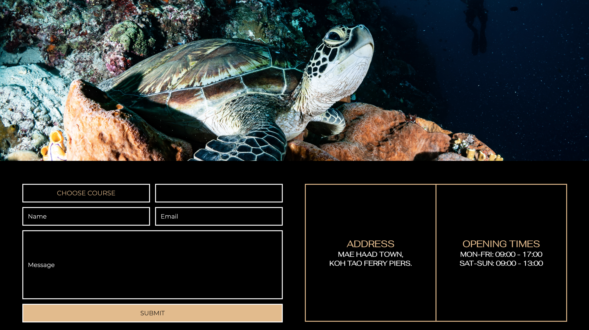

# **SCUBA DIVE CENTRE**

The Scuba Dive Centre website is a landing page for young and experienced divers from the age of 10 and above. The dive centre is based in Koh Tao, Thailand and offers different courses to explore the diverse marine ecosystem in this specific area.

Users of this website will be able to find information on variety of dive sites and diverse marine life, weather conditions and island information. There are listed what differnet courses includes, license details and the speific requirements to enroll each course, which can be enquired with a form. This website is targeted towards travelers within Southeast Asia.

# NAVIGATION

## HEADER

### The header contains the navigation menu with pages links and the logo.

### Featured at the top of the page the navigation shows the logo incorporation with the name of the dive centre.

### Underneath are featured the centred links, that navigate through the home, about, courses and contact pages of the website.

### The logo clearly tells the name of the dive centre and it contrasts with the background, along with the links pages.

## HOME PAGE

## SECTION HOME

### First part of the section is a video that presents underwater marine life with colorful fish swimming, accessible with controls and muted.

### Second part of the section presents two containers, visualy separated with a border.

### Container on the left shows a heading of the name and a paragraph with content about the dive centre

### Container on the right shows a button that leads to more information, which is about page and underneath, there is a paragraph with more content about the dive sites

## FOOTER

### Footer consists of three columns, firtst one contains phone and email contact of the centre. The second one presents the social media icons, which when clicked lead to open link in a new tab. Last column of the footer is the once again the logo.

## ABOUT PAGE

## COURSES PAGE

## CONTACT PAGE

## REGARDS PAGE

# TESTING

## I tested this page in different browsers: Chrome, Safari.

## I confirm this project is responsive, looks good and functions on all standart screen sizes using the devtools device toolbar.

## I confirm the navigation, home, about, courses, contact text are all readable and easy to understand.

## I confirm the contact form works, requires entries in every field, 

# BUGS

## Solved bugs

# Validator testing

## HTML

### No errors were returned when passing through the official W3C validator.

## CSS

### No errors were returned when passing through the official Jigsaw validator.

## ACCESSIBILITY

### The chosen fonts and colors are easy to read accessible, after running through lighthouse in devtools.

# DEPLOYMENT

### This site was deployed to GitHub Pages.

# MEDIA

### All images and videos were taken from [pexels](https://www.pexels.com/) .