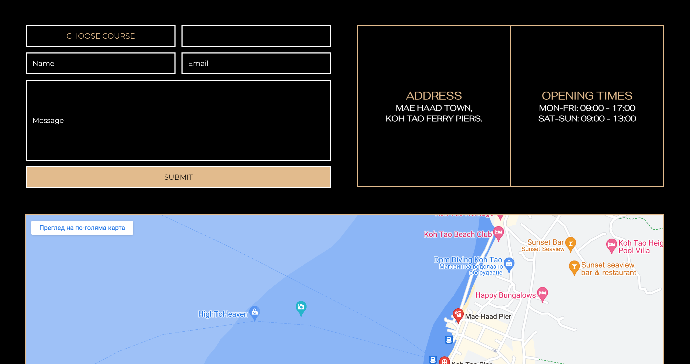

# **SCUBA DIVE CENTRE**

The Scuba Dive Centre website is a landing page for young and experienced divers from the age of 10 and above. The dive centre is based in Koh Tao, Thailand, and offers different courses to explore the diverse marine ecosystem in this specific area.

Users of this website will be able to find information on variety of dive sites and diverse marine life, weather conditions and island information. There are listed what differnet courses include, license details and the specific requirements to enroll each course, which can be enquired with a form. This website is targeted at travelers within Southeast Asia.

# INITIAL WIREFRAMES

### Rough wireframes created in [draw.io](https://app.diagrams.net/)

### Desktop Version

### Tablet and Mobile Version

# NAVIGATION

## HEADER

### The header contains the navigation menu with pages' links and the logo.

### Featured at the top of the page the navigation shows the logo incorporation with the name of the dive centre.

### Underneath are featured the centred links, that navigate through the home, about, courses and contact pages of the website.

### The logo clearly tells the name of the dive centre and it contrasts with the background, along with the links pages.

## **HOME PAGE**

## HOME SECTION

### First part of the section is a video that presents underwater marine life with colorful fish swimming, accessible with controls and muted.

### Second part of the section presents two containers, visually separated by a border.

### Container on the left shows a heading of the name and a paragraph with content about the dive centre

### Container on the right shows a button that leads to more information, which is about page and underneath, there is a paragraph with more content about the dive sites

## FOOTER

### Footer consists of three columns, firtst one contains phone and email contact of the centre. The second one presents the social media icons, which when clicked lead to open link in a new tab. Last column of the footer is the once again the logo.

## **ABOUT PAGE**

### Repeats the header, underlining the current page.

## ABOUT SECTION

### Repeats, the design of the website, presenting a main image with 100% width across the page, instead of the video on the home page, with the same width.

### The image is followed by two columns, with more information about the dive centre, each containing an appropriate image.

### The second column contains a button as well, that leads to courses page.

### Repeats footer.

## **COURSES PAGE**

### Repeats the header, underlining the current page.

### Repeats, the design of the website, presenting a different main image, with 100% width across the page and the same width.

### The image is followed by three columns, with a button on the top leading to the contact form in the contact page. There is more information about the each course underneath and an image at the bottom of the containers.

## CONTACT PAGE

### Repeats the header, underlining the current page

## CONTACT SECTION

### Repeats, the design of the website, presenting a different main image, with 100% width across the page and the same width.

## CONTACT CONTENT

### Consists of three containers, one with enquiry form, one with address and openings and an embeded map.

## REGARDS PAGE

### This page repeats header and footer, giving access to use the full navigation across the website. There is the same style layout image, with regards text on top, underlined with a darker seethrough background, in order to give easy readability of the text.

# TESTING

### I tested this page in different browsers: Chrome, Safari.

### I confirm this project is responsive, looks good and functions on all standard screen sizes using the devtools device toolbar.

### I confirm the navigation, home, about, courses, contact text are all readable and easy to understand.

### I confirm the contact form works, requires entries in every field, specified to email and submit button.

# BUGS

## Solved bugs

### When I ran my html code through W3C validator I found out my buttons do not work, because I had incorrectly used input as a descendant of a element. This was solved with a button element wrapped in a form with the correct path in action attribute.

# Validator testing

## HTML

### No errors were returned when passing through the official W3C validator.

## CSS

### No errors were returned when passing through the official Jigsaw validator.

## ACCESSIBILITY

### The chosen fonts and colors are easy to read accessible, after running through lighthouse in devtools.

# DEPLOYMENT

### This site was deployed to GitHub Pages.

# CLONE

## To clone the GitHub repository, navigate to its main page and click the code button, copy the URL, under "HTTPS". Open the terminal and change the directory to the desired destination for clone repo. Type git clone and paste the copied URL and press enter.

# FORK

## Find [octocat/Spoon-Knife](https://github.com/octocat/Spoon-Knife) repo on GitHub and click Fork. Select an Owner from the dropdown menu. Add a name and description. Select Copy the DEFAULT branch only, if you do not wish to copy all branches and click fork.

# CREDITS

## WIREFRAMES

### Wireframes created in [draw.io](https://app.diagrams.net/)

## MEDIA

### All images and videos were taken from [pexels](https://www.pexels.com/) .